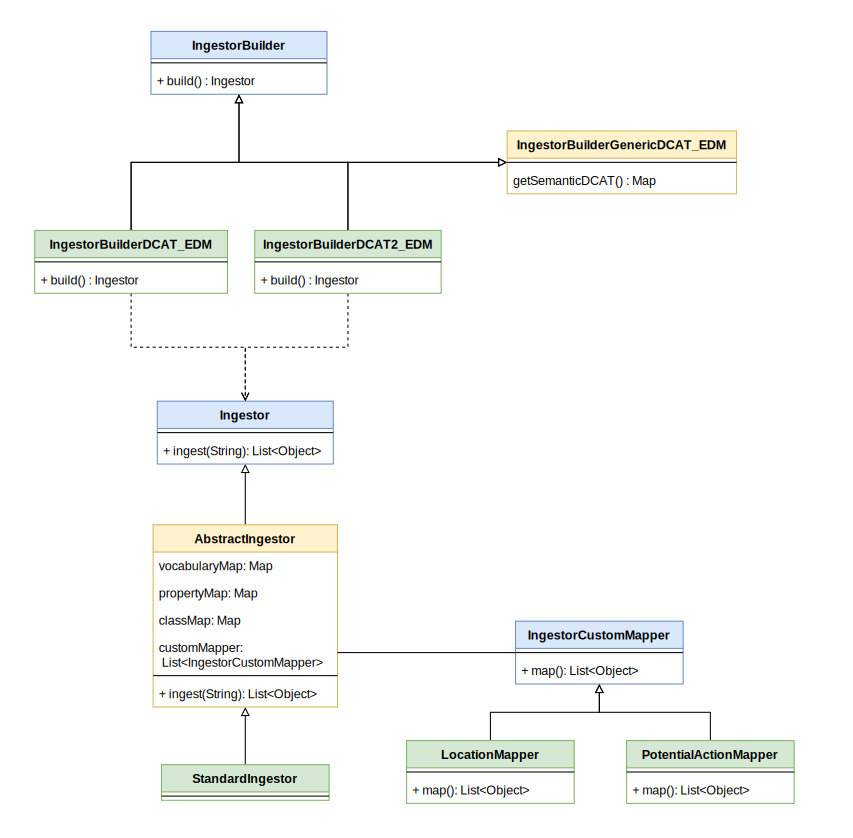

  
# Ingestor-Service

## Introduction
This document discusses the ICS-C's _Ingestor-Service_, which is responsible of traslating all the entities insiede the 
metadata ttl file into the EPOS Data Model in order to be stored into the EPOS's Metadata Catalogue.
  
## Module Description

### Overview  
The purpose of the ICS-C's _Ingestor-Service_ component is to support the ingestion of metadata (describing the digital assets of the TCSs) into EPOS's metadata catalogue.

The metadata is typically supplied to the _Ingestor-Service_ in the form of RDF-based files that adhere to the EPOS-DCAT-AP model \[1\]. There are various serialisation formats that can be used to define an RDF model but the _Ingestor-Service_ currently supports just the more human-readable, Turtle (TTL), serialisation. The _Ingestor-Service_ will take the supplied metadata and convert it into a relational representation (EPOS Data Model) and then persist it to a relational database. The metadata's representation in the relational database, to a large extent, mirrors that of its original RDF format in that it is persisted in a triple-store fashion.   

The metadata files to ingest can be specified in a number of ways but typically the request to ingest a file, or set of files, is initiated by an administrator-level user and the request typically arrives at the _Ingestor-Service_ component via the internal REST API of the service.

### Features

#### Feature: Ingestion Requests
The _Ingestor_ supports 3 types of request relating to the ingestion of EPOS-DCAT-AP content (via a TTL serialisation):
1. Ingest content streamed from a URL supplied within the request.
2. Ingest content streamed from multiple URLs. The multiple URLs are declared on separate lines within a text file. The text file itself must be available via a URL which is supplied within the request.

##### 1. Ingest EPOS-DCAT-AP content streamed from multiple URLs
To ingest multiple instances of TTL-serialised EPOS-DCAT-AP content a text file should be created containing URLs referencing the content instances to be ingested. The text file should contain only URLs and they should be on separate lines.
In this case each content instance to be ingested would lead to a separate atomic commit to the database.
If, for example, there were 5 content instances and the first 3 were ingested without issue these would have led to 3 commits to the database. If the 4th was to fail ingestion then no attempt would be made to ingest the final 5th instance.

##### 2. Ingest EPOS-DCAT-AP content streamed from a URL
To ingest TTL-serialised EPOS-DCAT-AP content streamed from a URL the request payload should be defined as a JSONObject string.
For this type of request the JSONObject should declare 2 properties:

### Assumptions 
Ingestion via the Ingestion-Service require the semantic layer of the underlying Metadata Catalog data store be pre-populated with information related to the permitted resource types for the EPOS-DCAT-AP model.

## Design of the mapping

